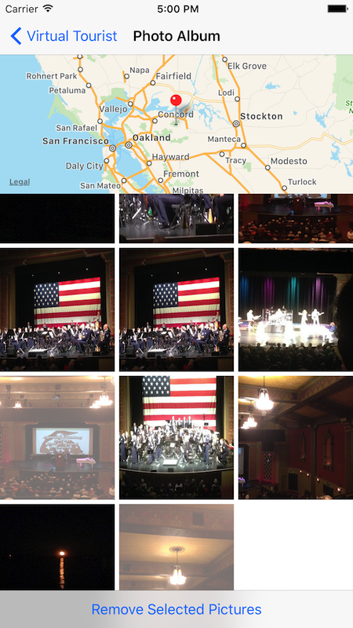

# Virtual-Tourist
This app enables you to explore the world via the comfort of your home, or wherever you are.

## Some features
Using a component of the Flickr API, [flickr.photos.search](https://www.flickr.com/services/api/flickr.photos.search.html), it can show you pictures of tapped places.

It also stores these photos persistently, so you can continue your photo viewing **even when you don't have internet connection.**

